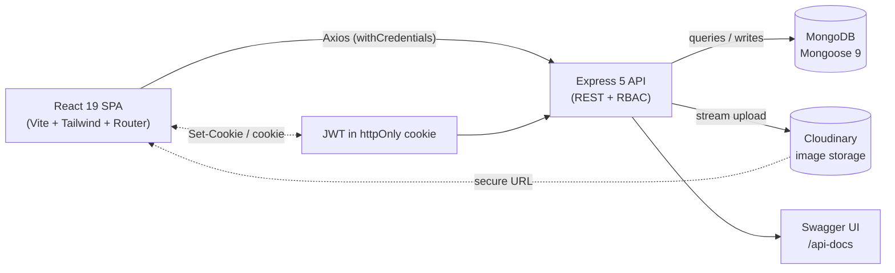

# Blog MERN — Step-by-Step Build Guide

> **Archived: original build playbook.** This guide is the original roadmap used to build Blog MERN. It documents, phase by phase, how the platform was assembled from an empty folder to a deployed full-stack application. The codebase may have evolved since this guide was written — for current setup, architecture, and deployment notes, see [../README.md](../README.md).

---

> **Project Summary:** Blog MERN is a full-stack blogging platform with a three-tier role system (User -> Author -> Admin), a post approval workflow, and both guest and registered interactions. Visitors can read published posts, search/sort them, and like posts anonymously via a fingerprint. Registered users can comment and apply to become authors. Approved authors submit posts that move through a draft -> pending -> published/rejected lifecycle moderated by admins. Admins get a full dashboard for managing users, author requests, posts, and comments. Authentication uses a JWT delivered in an httpOnly cookie, and the backend is hardened with Helmet, a CORS whitelist, multi-tier rate limiting, NoSQL sanitization, HPP protection, and server-side HTML sanitization. Images are stored on Cloudinary. The stack is MongoDB, Express 5, React 19, and Node.js.

Each step below is a self-contained prompt. Execute them in order.

Stack: MongoDB (Mongoose 9), Express 5, React 19, Node.js 20+, Vite 8, Tailwind CSS 4, React Router 7, JWT (httpOnly cookie), Cloudinary, Swagger (OpenAPI 3). Backend on Render, frontend on Netlify.

---

## Table of Contents

**PHASE 1 — Backend Foundation**

- STEP 1 — Project Scaffolding & Dependency Setup
- STEP 2 — Environment Config, Validation & Database Connection
- STEP 3 — Express App, Security Middleware & Error Handling
- STEP 4 — User Model & JWT Cookie Authentication

**PHASE 2 — Backend Resources**

- STEP 5 — Auth Controller & Routes
- STEP 6 — Post Model & CRUD with Approval Workflow
- STEP 7 — Likes (Registered + Guest Fingerprint)
- STEP 8 — Comments
- STEP 9 — Author Requests
- STEP 10 — Cloudinary Image Upload
- STEP 11 — User Profiles & Preferences
- STEP 12 — Admin Panel API
- STEP 13 — Swagger / OpenAPI Documentation
- STEP 14 — Seed Scripts

**PHASE 3 — Client Foundation**

- STEP 15 — Vite + Tailwind Setup & Theme System
- STEP 16 — Axios Instance & API Service Modules
- STEP 17 — Auth & Preferences Context
- STEP 18 — Routing, Layouts & Route Guards
- STEP 19 — Shared UI Components

**PHASE 4 — Client Pages**

- STEP 20 — Home, Post Detail & Search
- STEP 21 — Auth Pages (Login / Register)
- STEP 22 — Author Workspace (Create / Edit / My Posts)
- STEP 23 — Author Request & Public User Profile
- STEP 24 — Settings Pages
- STEP 25 — Admin Panel UI

**PHASE 5 — Polish & Deploy**

- STEP 26 — Responsive, Accessibility & UX Polish
- STEP 27 — Deployment (Render + Netlify)

**Appendices**

- Appendix A — Shared Constants & Environment Reference
- Appendix B — Security Checklist
- Appendix C — Common Pitfalls
- Appendix D — Pre-flight Checklist

---

## Global Build Rules (apply to EVERY step)

- **No git operations.** Do not run `git` commands, do not commit, and do not push. Version control is handled manually by the user.
- **No unapproved packages.** Only install the dependencies a step explicitly lists. Prefer native methods over new dependencies.
- **No long-running processes** (dev servers, watchers, deploys) unless the user explicitly asks for them.
- **Treat every step as self-contained.** Each step states its goal, the files it touches, the dependencies it needs, and an acceptance check.
- **Modern code only.** Use ES6+, React Hooks, async/await, and follow existing local patterns.
- **Security, accessibility, and performance first.** Validate input, enforce authorization server-side, label interactive elements, and avoid N+1 queries.
- **Naming.** English, descriptive, camelCase for variables and functions; PascalCase for React components and Mongoose models.

---

## Architecture at a Glance



The client is a single-page React app served by Netlify, which proxies `/api/*` to the Render-hosted Express API through `netlify.toml` to keep cookies same-origin. The API authenticates requests by reading a JWT from an httpOnly cookie, enforces role-based access with middleware, persists data in MongoDB via Mongoose, and offloads image storage to Cloudinary. OpenAPI docs are served at `/api-docs`.

---

# PHASE 1 — BACKEND FOUNDATION

---

## STEP 1 — Project Scaffolding & Dependency Setup

**Goal:** Create the monorepo layout and install backend dependencies.

**Files/folders to create:**

- `server/` with `src/` and a `package.json` (`"type": "commonjs"`)
- `client/` (scaffolded later in Phase 3)
- `server/.env.example`, `server/.gitignore`

**Dependencies (server):**

```bash
npm install express mongoose dotenv jsonwebtoken bcryptjs cookie-parser cors helmet hpp \
  express-rate-limit express-mongo-sanitize express-validator slugify multer cloudinary \
  sanitize-html swagger-jsdoc swagger-ui-express uuid
npm install -D nodemon
```

**Implementation notes:**

- Add scripts to `server/package.json`: `dev` (`nodemon src/index.js`), `start` (`node src/index.js`), `seed:admin`, `seed:posts`.
- Commit secrets only to `.env` (git-ignored); keep `.env.example` with placeholders.

**Acceptance:** `npm run dev` starts (even before routes exist) and `server/.env.example` documents every required variable (see Appendix A).

---

## STEP 2 — Environment Config, Validation & Database Connection

**Goal:** Centralize environment access and connect to MongoDB resiliently.

**Files:** `server/src/config/env.js`, `server/src/config/db.js`

**Implementation notes:**

- `env.js` loads `dotenv`, exposes a typed `env` object, and **fails fast**: throw if `MONGO_URI` is missing, and in production require `JWT_SECRET` length >= 32.
- `db.js` connects with `mongoose.connect` using `serverSelectionTimeoutMS` and a small **retry loop** (e.g. 5 attempts, 3s apart) before `process.exit(1)`.

**Acceptance:** Booting with a missing `MONGO_URI` throws a clear fatal error; a valid URI logs the connected host.

---

## STEP 3 — Express App, Security Middleware & Error Handling

**Goal:** Compose the Express app with a deliberate, security-first middleware order.

**Files:** `server/src/index.js`, `server/src/middlewares/errorHandler.js`

**Implementation notes (middleware order matters):**

1. `app.set("trust proxy", 1)` and `app.disable("x-powered-by")`.
2. `helmet()` with a CSP that allows inline styles for Swagger UI and the welcome page.
3. `cors({ origin: CLIENT_URL, credentials: true })`.
4. `cookieParser()`.
5. `express.json({ limit: "10kb" })` and `express.urlencoded({ extended: false, limit: "10kb" })`.
6. Express 5 shim: make `req.query` writable so `mongoSanitize` and `hpp` can mutate it.
7. `mongoSanitize()` then `hpp()`.
8. Rate limiters: global API (100/15min), auth (10/15min), admin (60/15min), guest-like (30/15min).
9. Routes, then the global `errorHandler` **last**.

- `errorHandler` maps Mongoose `ValidationError` (400), duplicate key `11000` (409), `CastError` (400), and JWT errors (401); hides internal details in production.

**Acceptance:** `GET /api/health` returns `{ status: "ok", version, uptime }`; unknown routes and thrown errors return a consistent `{ success: false, message }` shape.

---

## STEP 4 — User Model & JWT Cookie Authentication

**Goal:** Define the user schema and the cookie-based auth primitives.

**Files:** `server/src/models/User.js`, `server/src/utils/generateToken.js`, `server/src/utils/cookieToken.js`, `server/src/middlewares/auth.js`

**Implementation notes:**

- `User` fields: `name`, `email` (unique, lowercase), `password` (`select: false`), `avatar`/`avatarPublicId`, `role` enum `["user","author","admin"]`, `bio`, and a nested `preferences` sub-document (theme, fontSize, contentDensity, animationsEnabled, language, privacy, notifications, postsPerPage, defaultSort).
- Hash the password in a `pre("save")` hook (bcrypt salt 12); add a `comparePassword` method.
- `generateToken(userId)` signs `{ id }` with `JWT_SECRET` and `JWT_EXPIRES_IN`.
- `cookieToken.js` exports `COOKIE_NAME`, `setTokenCookie` (httpOnly, `sameSite: lax`, `secure` in production, 7-day maxAge), and `clearTokenCookie`.
- `auth.js`: `extractToken` (cookie first, then `Authorization: Bearer` fallback), `protect`, `optionalAuth`, `adminOnly`, and `authorOrAdmin`. Use optional chaining (`req.user?.role`) in role guards so they fail safe.

**Acceptance:** A signed token round-trips through `setTokenCookie` -> `protect` and attaches `req.user`; role guards reject mismatched roles with 403.

---

# PHASE 2 — BACKEND RESOURCES

---

## STEP 5 — Auth Controller & Routes

**Goal:** Implement the authentication and account-management endpoints.

**Files:** `server/src/controllers/authController.js`, `server/src/routes/authRoutes.js`, `server/src/validators.js`, `server/src/middlewares/validate.js`

**Endpoints:** `POST /register`, `POST /login`, `POST /logout`, `GET /me`, `PUT /me`, `PUT /me/password`, `DELETE /me`, `PUT /me/preferences`.

**Implementation notes:**

- Use `express-validator` rule sets in `validators.js` and a shared `validate` middleware that returns 400 with the collected errors.
- `formatUserResponse` strips the password from every response.
- **User enumeration defense:** login returns an identical message for unknown email and wrong password.
- `register`/`login` call `setTokenCookie`; `logout` calls `clearTokenCookie`.
- `deleteAccount` requires the password, blocks deleting the last admin, and cascades (posts, comments, guest likes, author requests, like-array cleanup, Cloudinary assets) inside a Mongoose transaction.

**Acceptance:** Full register -> login -> me -> logout cycle works through the cookie; account deletion removes all owned data atomically.

---

## STEP 6 — Post Model & CRUD with Approval Workflow

**Goal:** Model posts and implement the draft/pending/published/rejected lifecycle.

**Files:** `server/src/models/Post.js`, `server/src/controllers/postController.js`, `server/src/routes/postRoutes.js`

**Implementation notes:**

- `Post` fields: `title`, `slug` (unique), `content`, `image`/`imagePublicId`, `author` ref, `status` enum, `rejectionReason`, `likes` (ObjectId array), `guestLikeCount`, denormalized `totalLikeCount` (indexed), `commentsCount`, `tags`.
- Generate the slug in a `pre("save")` hook; add a `saveWithSlugRetry` static that retries on duplicate-key (`11000`) with a random hex suffix to avoid read-before-write races.
- Add a text index (`title`, `content`, `tags`) with weights and a `{ totalLikeCount: -1, createdAt: -1 }` index for popular sorting.
- Sanitize content server-side with `sanitize-html` (strip all tags) and validate image URLs (allow only `/uploads/` paths or http/https).
- Status rules: admins auto-publish; authors create drafts and submit to pending; editing a published/pending/rejected post reverts it to draft unless re-submitted.
- `GET /posts` lists published only (paginated, searchable, sortable). `GET /posts/:slug` exposes non-published posts only to the owner or an admin.

**Acceptance:** Authors cannot publish directly; only owners/admins can edit/delete; public listing never leaks non-published posts.

---

## STEP 7 — Likes (Registered + Guest Fingerprint)

**Goal:** Toggleable likes for both authenticated users and anonymous guests.

**Files:** `server/src/models/GuestLike.js`, `server/src/controllers/likeController.js`, `server/src/routes/likeRoutes.js`

**Implementation notes:**

- Registered toggle is **atomic**: try `$pull` first; if nothing was removed, `$addToSet`. Recompute and persist `totalLikeCount`.
- `GuestLike` stores `{ postId, fingerprint }` with a unique compound index. Validate the fingerprint as a UUID v4. Treat duplicate-key on create as "already liked".
- Derive `guestLikeCount` from the `GuestLike` collection (authoritative) and sync onto the post.
- Guest-like routes are covered by the dedicated rate limiter.

**Acceptance:** Liking/unliking is idempotent under concurrency; guest and registered counts combine correctly into `totalLikeCount`.

---

## STEP 8 — Comments

**Goal:** Comments on published posts with accurate counts.

**Files:** `server/src/models/Comment.js`, `server/src/controllers/commentController.js`, `server/src/routes/commentRoutes.js`

**Implementation notes:**

- Comments only allowed on published posts; `commentsCount` is incremented/decremented with `$inc`.
- Delete allowed by the comment owner or an admin.
- `GET /users/:userId/comments` respects the target user's `showComments` privacy preference (owner bypasses) and uses an aggregation that joins published posts only.

**Acceptance:** Counts stay consistent across create/delete; private profiles hide comments from non-owners.

---

## STEP 9 — Author Requests

**Goal:** Let users apply for the author role with admin review.

**Files:** `server/src/models/AuthorRequest.js`, `server/src/controllers/authorRequestController.js`, `server/src/routes/authorRequestRoutes.js`

**Implementation notes:**

- `AuthorRequest`: `user`, `message`, `status` enum `["pending","approved","rejected"]`, `rejectionReason`, `reviewedBy`, `reviewedAt`.
- Users may have one active request; expose `GET /author-requests/mine` and `DELETE /author-requests/mine` to cancel.
- Approval/rejection lives in the admin controller (Step 12) and promotes the user to `author` on approval.

**Acceptance:** A user can submit, view status, and cancel; duplicate active requests are prevented.

---

## STEP 10 — Cloudinary Image Upload

**Goal:** Secure image uploads to Cloudinary.

**Files:** `server/src/config/cloudinary.js`, `server/src/middlewares/upload.js`, `server/src/routes/uploadRoutes.js`, `server/src/utils/cloudinaryDelete.js`

**Implementation notes:**

- Configure the Cloudinary SDK from env. Use Multer with a memory/stream strategy, a MIME whitelist, and a size limit.
- `POST /api/upload` (auth required) returns the secure URL and `public_id`.
- `cloudinaryDelete.js` exposes single and batch delete helpers used during post/avatar replacement and account deletion.

**Acceptance:** Only authenticated users can upload valid image types under the size cap; replaced assets are cleaned up.

---

## STEP 11 — User Profiles & Preferences

**Goal:** Public profiles and server-enforced preferences.

**Files:** `server/src/controllers/userController.js`, `server/src/routes/userRoutes.js`

**Implementation notes:**

- `GET /users/:userId` returns public fields, post count, and a comment count gated by privacy. Email is exposed only if `showEmail` is true.
- `GET /users/:userId/liked-posts` respects `showLikedPosts` (owner bypasses).
- `PUT /auth/me/preferences` validates each field with a whitelist map and supports both flat (`"privacy.showEmail"`) and nested input via `$set`.

**Acceptance:** Privacy preferences are enforced server-side, not merely hidden in the UI.

---

## STEP 12 — Admin Panel API

**Goal:** Full moderation surface for admins.

**Files:** `server/src/controllers/adminController.js`, `server/src/routes/adminRoutes.js`

**Implementation notes:**

- Guard the whole router with `protect` + `adminOnly`; the admin rate limiter applies.
- Dashboard aggregates counts and recent activity in parallel with `Promise.all`.
- User management: list (with safe regex search via `escapeRegex`), detail, role change (cannot demote the last admin, cannot change own role), and delete (cannot delete self or another admin) with transactional cascade.
- Post moderation: list/pending, approve, reject (with reason), delete with related cleanup.
- Comment moderation: list (search across text/user/post) and delete with count fix.

**Acceptance:** Every admin action enforces the "keep at least one admin" and self-protection invariants.

---

## STEP 13 — Swagger / OpenAPI Documentation

**Goal:** Serve interactive API docs.

**Files:** `server/src/config/swagger.js`, `server/src/docs/*.js`, mount in `index.js`

**Implementation notes:**

- Define the OpenAPI 3 base (info, servers, reusable schemas, security scheme) in `swagger.js` and write per-resource JSDoc annotations in `src/docs/`.
- Mount `swagger-ui-express` at `/api-docs` and add a styled welcome page at `/`.

**Acceptance:** `/api-docs` renders all endpoint groups; `/` links to docs and health.

---

## STEP 14 — Seed Scripts

**Goal:** Bootstrap an admin and optional sample content.

**Files:** `server/src/scripts/seedAdmin.js`, `server/src/scripts/seedPosts.js`, `server/src/scripts/migrateTotalLikeCount.js`

**Implementation notes:**

- `seedAdmin` upserts the admin from `ADMIN_EMAIL`/`ADMIN_PASSWORD`.
- `seedPosts` inserts demo posts for local development.
- `migrateTotalLikeCount` backfills the denormalized like count for older documents.

**Acceptance:** `npm run seed:admin` creates a working admin login; the migration is idempotent.

---

# PHASE 3 — CLIENT FOUNDATION

---

## STEP 15 — Vite + Tailwind Setup & Theme System

**Goal:** Scaffold the React SPA with a CSS-variable theme.

**Files:** `client/` (Vite React), `client/vite.config.js`, `client/src/index.css`, `client/.env.example`, `client/netlify.toml`

**Dependencies (client):**

```bash
npm install react react-dom react-router-dom axios react-hot-toast react-icons uuid dompurify
npm install -D vite @vitejs/plugin-react tailwindcss @tailwindcss/vite eslint
```

**Implementation notes:**

- Use the `@tailwindcss/vite` plugin. Define light/dark themes with CSS variables in `index.css` and toggle a `dark` class on `<html>`.
- Add class hooks for font size (`text-size-*`), content density (`density-*`), and animation toggles.
- `netlify.toml`: proxy `/api/*` to the Render backend (before the SPA fallback) and add the `/* -> /index.html` fallback.

**Acceptance:** `npm run dev` renders an app shell; switching the `dark` class restyles via variables.

---

## STEP 16 — Axios Instance & API Service Modules

**Goal:** Centralize HTTP access.

**Files:** `client/src/api/axios.js`, `client/src/api/services/*.js`

**Implementation notes:**

- Create an Axios instance with `baseURL = VITE_API_URL || "/api"`, `withCredentials: true`, and a timeout.
- Request interceptor: strip `Content-Type` for `FormData` so the browser sets the boundary.
- Response interceptor: on 401 with a known token-failure message, redirect to `/login`, but skip the silent `GET /auth/me` session check.
- One service module per resource (auth, post, like, comment, authorRequest, upload, user, admin).

**Acceptance:** All network calls flow through services; cookies are sent automatically.

---

## STEP 17 — Auth & Preferences Context

**Goal:** Global auth and preference state.

**Files:** `client/src/context/AuthContext.jsx`, `client/src/context/PreferencesContext.jsx`, `client/src/hooks/useAuth.js`, `client/src/hooks/usePreferences.js`, `client/src/hooks/useGuestFingerprint.js`, `client/src/hooks/useLocalStorage.js`

**Implementation notes:**

- `AuthContext` verifies the session on mount via `GET /auth/me`, exposes `login`/`register`/`logout`/`updateUser`/`updateUserPreferences`, and memoizes derived flags (`isAuthenticated`, `isAdmin`, `isAuthor`, `canCreatePost`).
- `PreferencesContext` applies theme/font/density/animation to the DOM, syncs to the server for authenticated users, and to `localStorage` for guests. Keep the guest default `language` aligned with the server default (`en`).
- `useGuestFingerprint` generates and persists a UUID v4 for anonymous likes.

**Acceptance:** Refreshing keeps the session; preference changes persist for both guests and logged-in users.

---

## STEP 18 — Routing, Layouts & Route Guards

**Goal:** Define routes, nested layouts, and access guards.

**Files:** `client/src/App.jsx`, `client/src/layouts/*.jsx`, `client/src/components/routes/*.jsx`, `client/src/components/ScrollToTop.jsx`

**Implementation notes:**

- Layouts: `MainLayout` (Navbar + Footer), `AdminLayout` (sidebar/drawer), `SettingsLayout` (side nav).
- Guards: `ProtectedRoute`, `AuthorRoute`, `AdminRoute`, `GuestOnlyRoute` — each reads `useAuth`, shows a spinner while `loading`, then redirects or renders `<Outlet />`.
- Mount the `react-hot-toast` `Toaster` once in `App.jsx`.

**Acceptance:** Unauthenticated users are redirected from protected routes; admins reach `/admin`; logged-in users are kept off `/login`.

---

## STEP 19 — Shared UI Components

**Goal:** Reusable, accessible primitives.

**Files:** `client/src/components/ui/*.jsx` (Spinner, EmptyState, ConfirmModal, StatusBadge, RoleBadge, ToggleSwitch, SelectableCard, CharacterCounter, PostCardSkeleton, SanitizedHtml), plus `PostCard`, `Pagination`, `CommentSection`, `Navbar`, `Footer`.

**Implementation notes:**

- `SanitizedHtml` renders HTML only after `DOMPurify.sanitize` with a strict tag/attribute allowlist.
- `ConfirmModal` traps focus and closes on Escape; badges and toggles expose proper ARIA roles/labels.

**Acceptance:** Components are presentational, themed via variables, and keyboard accessible.

---

# PHASE 4 — CLIENT PAGES

---

## STEP 20 — Home, Post Detail & Search

**Goal:** Public reading experience.

**Files:** `client/src/pages/HomePage.jsx`, `client/src/pages/PostDetailPage.jsx`, `client/src/components/Pagination.jsx`

**Implementation notes:**

- Home: paginated grid with debounced search and sort (newest/popular/mostCommented); show skeletons while loading and an `EmptyState` when empty.
- Detail: fetch by slug, render author, content, like button (registered or guest), and the comment section.

**Acceptance:** Search is debounced, pagination/sort update the query, and likes reflect optimistic state.

---

## STEP 21 — Auth Pages (Login / Register)

**Goal:** Authentication forms.

**Files:** `client/src/pages/LoginPage.jsx`, `client/src/pages/RegisterPage.jsx`

**Implementation notes:**

- Client-side validation mirrors server rules; submit through `AuthContext`; show field and toast errors; redirect to the intended route on success.

**Acceptance:** Successful auth sets the session and redirects; errors are surfaced clearly and accessibly.

---

## STEP 22 — Author Workspace (Create / Edit / My Posts)

**Goal:** Author content management.

**Files:** `client/src/pages/CreatePostPage.jsx`, `client/src/pages/EditPostPage.jsx`, `client/src/pages/MyPostsPage.jsx`

**Implementation notes:**

- Create/Edit: title, content, tags, and Cloudinary image upload with preview and a `CharacterCounter`; offer "Save draft" vs "Submit for review".
- My Posts: filter by status, show `StatusBadge` and rejection reasons, allow submit/edit/delete with `ConfirmModal`.

**Acceptance:** Authors can move a post through draft -> pending and resubmit rejected posts.

---

## STEP 23 — Author Request & Public User Profile

**Goal:** Author application and public profiles.

**Files:** `client/src/pages/BecomeAuthorPage.jsx`, `client/src/pages/UserProfilePage.jsx`

**Implementation notes:**

- Become Author: motivation textarea with validation and current request status.
- Profile: tabs for posts, liked posts, and comments, each respecting privacy responses from the API.

**Acceptance:** Request status is reflected live; private tabs are hidden for non-owners.

---

## STEP 24 — Settings Pages

**Goal:** Six preference sub-pages under a shared layout.

**Files:** `client/src/layouts/SettingsLayout.jsx`, `client/src/pages/settings/*.jsx` (Profile, Account, Appearance, Privacy, Notifications, Content)

**Implementation notes:**

- Each page edits a slice of preferences/profile and persists via `updateUserPreferences`/`updateUser`. Use `ToggleSwitch`/`SelectableCard` for option groups.
- Account page handles password change and account deletion (with confirmation).

**Acceptance:** Changes persist server-side and immediately re-style the app where relevant.

---

## STEP 25 — Admin Panel UI

**Goal:** Admin dashboard and moderation screens.

**Files:** `client/src/layouts/AdminLayout.jsx`, `client/src/pages/admin/*.jsx` (Dashboard, Users, UserDetail, AuthorRequests, Posts, PendingPosts, Comments)

**Implementation notes:**

- Dashboard: stat cards and recent-activity lists. Tables paginate and search; destructive actions use `ConfirmModal`.
- Wire approve/reject/role-change/delete to `adminService`; surface the server invariants (last-admin protection) as friendly errors.

**Acceptance:** Admins complete the full moderation flow; the drawer navigation works on mobile.

---

# PHASE 5 — POLISH & DEPLOY

---

## STEP 26 — Responsive, Accessibility & UX Polish

**Goal:** Final quality pass.

**Implementation notes:**

- Verify mobile-first layouts, focus states, color contrast, and `aria-*` labels on interactive controls.
- Respect the animations preference (disable transitions when off). Add a `NotFoundPage` and consistent loading/empty states.
- Run `npm run lint` on the client and resolve warnings.

**Acceptance:** Keyboard-only navigation works end to end; no linter errors.

---

## STEP 27 — Deployment (Render + Netlify)

**Goal:** Ship the API and the SPA.

**Implementation notes:**

- **Backend -> Render:** Web Service, root `server`, build `npm install`, start `npm start`; set all env vars (Appendix A) with `NODE_ENV=production`; run `node src/scripts/seedAdmin.js` from the Render shell after first deploy.
- **Frontend -> Netlify:** base `client`, build `npm run build`, publish `client/dist`. Do **not** set `VITE_API_URL`; let `netlify.toml` proxy `/api/*` to Render so cookies stay same-origin. Update `CLIENT_URL` on Render to the Netlify URL for CORS.

**Acceptance:** Live site authenticates over the proxy with the httpOnly cookie; images upload to Cloudinary.

---

# Appendix A — Shared Constants & Environment Reference

**server/.env**

| Variable | Description |
| -------- | ----------- |
| `NODE_ENV` | `development` or `production` |
| `PORT` | Express port (default 5000) |
| `MONGO_URI` | MongoDB connection string (required) |
| `JWT_SECRET` | JWT signing secret (>= 32 chars in production) |
| `JWT_EXPIRES_IN` | Token lifetime (e.g. `7d`) |
| `CLIENT_URL` | Allowed CORS origin |
| `ADMIN_EMAIL` / `ADMIN_PASSWORD` | Seeded admin credentials |
| `CLOUDINARY_CLOUD_NAME` / `CLOUDINARY_API_KEY` / `CLOUDINARY_API_SECRET` | Cloudinary credentials |

**client/.env**

| Variable | Description |
| -------- | ----------- |
| `VITE_API_URL` | API base URL for local dev (omit in Netlify; the proxy handles it) |

**Enums:** roles `user|author|admin`; post status `draft|pending|published|rejected`; sort `newest|popular|mostCommented`.

---

# Appendix B — Security Checklist

- httpOnly cookie JWT (`sameSite=lax`, `secure` in production)
- Helmet headers + tuned CSP
- CORS whitelist with credentials
- Multi-tier rate limiting (api/auth/admin/guest-like)
- `express-mongo-sanitize` + `hpp`
- `sanitize-html` (server) + DOMPurify (client)
- 10kb body limit; Multer type/size validation
- Mass-assignment whitelists on updates
- Identical login error for unknown email vs wrong password
- Role guards on every protected route; last-admin protection
- Non-published posts never exposed publicly

---

# Appendix C — Common Pitfalls

- **Express 5 `req.query` is read-only** — add the writable shim before `mongoSanitize`/`hpp`.
- **Slug races** — use `saveWithSlugRetry` instead of read-before-write uniqueness checks.
- **Like double-counting** — derive guest counts from the `GuestLike` collection and recompute `totalLikeCount` atomically.
- **Cookie not sent** — ensure `withCredentials: true` on the client and `credentials: true` on CORS, and keep API same-origin in production via the Netlify proxy.
- **Cascade integrity** — wrap multi-collection deletes in a transaction and clean Cloudinary assets only after the DB commit.

---

# Appendix D — Pre-flight Checklist

- [ ] `server/.env` and `client/.env` populated from `.env.example`
- [ ] MongoDB reachable; `npm run seed:admin` succeeded
- [ ] Backend boots; `/api/health` and `/api-docs` respond
- [ ] Client builds (`npm run build`) and lints clean
- [ ] Auth cycle (register/login/logout) works over the cookie
- [ ] Post lifecycle and admin moderation verified
- [ ] Cloudinary upload + cleanup verified
- [ ] Production env vars set on Render; `CLIENT_URL` matches Netlify
